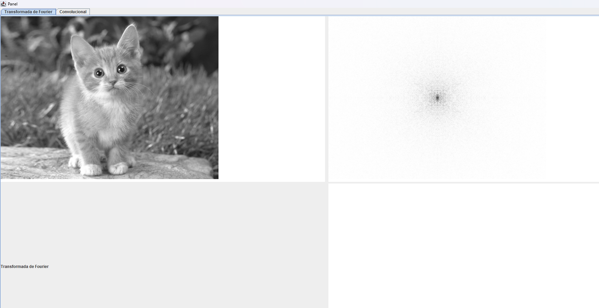
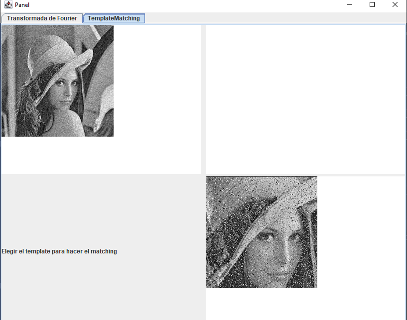
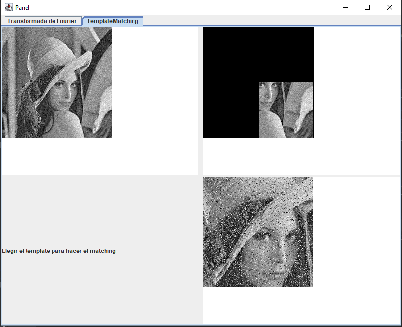

## Compilar y ejecutar
Ingresar en la carpeta y ejecutar "maven install".
Luego ejecutar el jar generado: "target/Practice3-1.0-SNAPSHOT-jar-with-dependencies.jar"

## Transformación de Fourier

Primero hacer click en el recuadro superior izquierdo y elegir una imagen.

Luego hacer click en el recuadro superior derecho y se generará la representación de la transformada.

## Template Matching 

Primero elegir la imagen y el template que se pretende buscar.

Despues seleccionar el espacio en blanco para calcular el matching del template
por la metrica de distancia euclidiana.

